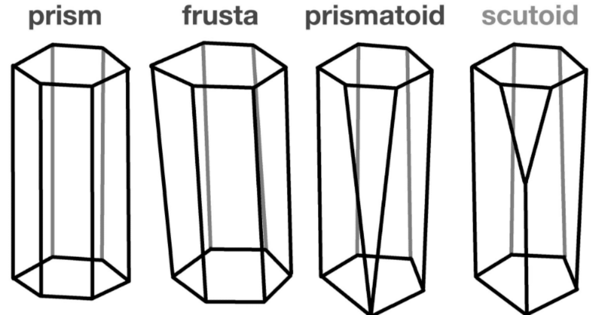
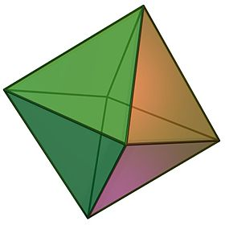

# A2 3d Figures

Assignment No 2 for the computer graphics course. Modify previous code examples to render the following:

- A 3D pyramid with a pentagon base as in Figure 1. The pyramid has to rotate around the axis [0.1, 1.0, 0.2].
- A [Scutoid](https://en.wikipedia.org/wiki/Scutoid), as in Figure 2. It has to rotate around the axis [-0.4, 1.0, 0.1].
- An Ochtahedron, as in Figure 3. It has to rotate around the axis [0, 1, 0]; it also has to move up and down within the canvas: it moves up until it reaches the top of the canvas, then it moves down until it reaches the bottom, and then it repeats.

Rubric:

1. The canvas was adjusted to include the 3 figures. The pyramid at the left of the canvas, the scutoid at the center, and the octahedron at the right.  *Incomplete* 
2. Created an independent function for each figure. *Incomplete* 
3. Defined the vertex, color, and index information for each figure. *Incomplete* 
4. Each face of each figure was rendered with a different color. *Incomplete* 
5. The figures were transformed correctly. *Incomplete* 0

**NOTES**

1. A cube and, presumably, a scutoid were rendered. The pyramid and octahedron were missing.
2. Only translations were applied, but not as instructed. Missing the rotations, and the movement of the octahedron.
3. It is not clear if the scutoid was correctly created, since no movement was implemented. Also, there is a burgandy color spot in the geometry that should not be there.

**Grade: 50; 35 for late submission**

 Figure 1: 3D Pyramid. 

 Figure 2: 3D Scutoid. 

 Figure 3: 3D Octahedron.